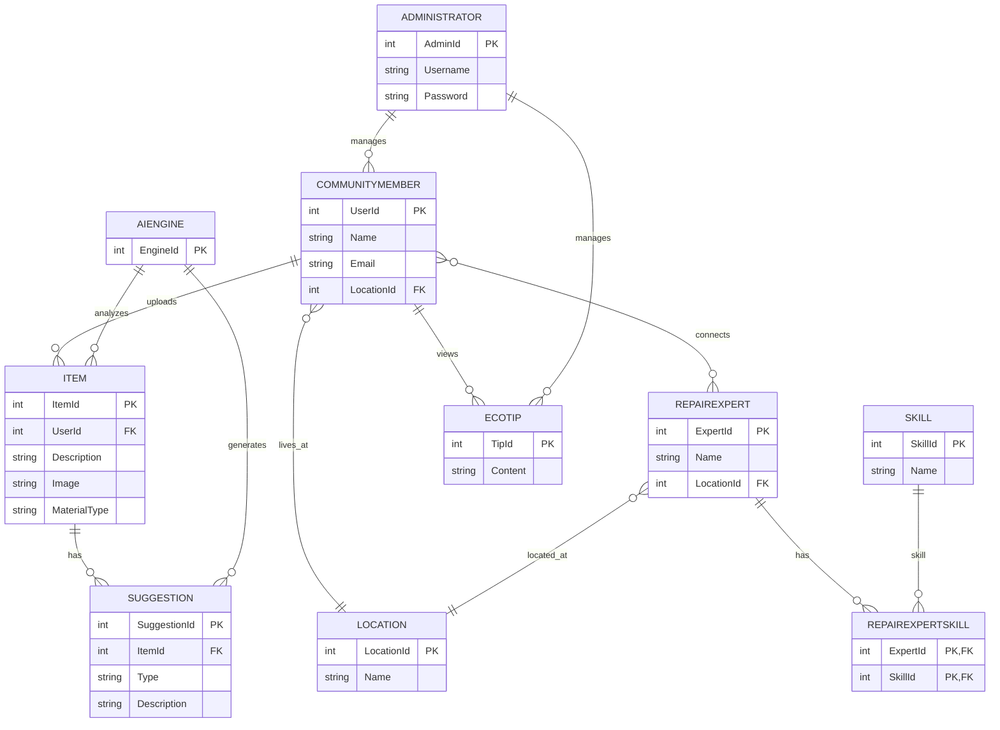
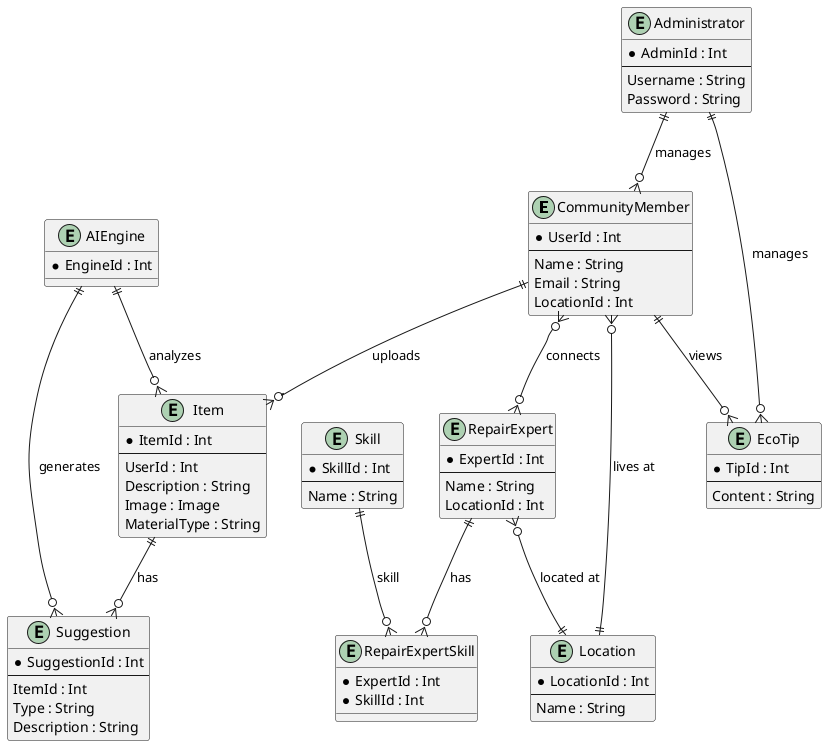

# ERD Diagram

## Mermaid

```mermaid
erDiagram
    COMMUNITYMEMBER {
        int UserId PK
        string Name
        string Email
        int LocationId FK
    }

    LOCATION {
        int LocationId PK
        string Name
    }

    ITEM {
        int ItemId PK
        int UserId FK
        string Description
        string Image
        string MaterialType
    }

    SUGGESTION {
        int SuggestionId PK
        int ItemId FK
        string Type
        string Description
    }

    AIENGINE {
        int EngineId PK
    }

    REPAIREXPERT {
        int ExpertId PK
        string Name
        int LocationId FK
    }

    SKILL {
        int SkillId PK
        string Name
    }

    REPAIREXPERTSKILL {
        int ExpertId PK, FK
        int SkillId PK, FK
    }

    ECOTIP {
        int TipId PK
        string Content
    }

    ADMINISTRATOR {
        int AdminId PK
        string Username
        string Password
    }

    COMMUNITYMEMBER ||--o{ ITEM : uploads
    ITEM ||--o{ SUGGESTION : has
    COMMUNITYMEMBER }o--o{ REPAIREXPERT : connects
    COMMUNITYMEMBER ||--o{ ECOTIP : views
    AIENGINE ||--o{ SUGGESTION : generates
    AIENGINE ||--o{ ITEM : analyzes
    ADMINISTRATOR ||--o{ COMMUNITYMEMBER : manages
    ADMINISTRATOR ||--o{ ECOTIP : manages

    COMMUNITYMEMBER }o--|| LOCATION : lives_at
    REPAIREXPERT }o--|| LOCATION : located_at

    REPAIREXPERT ||--o{ REPAIREXPERTSKILL : has
    SKILL ||--o{ REPAIREXPERTSKILL : skill
```

## PlantUML

```plantuml
@startuml ERD_Normalized

entity CommunityMember {
  * UserId : Int
  --
  Name : String
  Email : String
  LocationId : Int
}

entity Location {
  * LocationId : Int
  --
  Name : String
}

entity Item {
  * ItemId : Int
  --
  UserId : Int
  Description : String
  Image : Image
  MaterialType : String
}

entity Suggestion {
  * SuggestionId : Int
  --
  ItemId : Int
  Type : String
  Description : String
}

entity AIEngine {
  * EngineId : Int
}

entity RepairExpert {
  * ExpertId : Int
  --
  Name : String
  LocationId : Int
}

entity Skill {
  * SkillId : Int
  --
  Name : String
}

entity RepairExpertSkill {
  * ExpertId : Int
  * SkillId : Int
}

entity EcoTip {
  * TipId : Int
  --
  Content : String
}

entity Administrator {
  * AdminId : Int
  --
  Username : String
  Password : String
}

CommunityMember ||--o{ Item : uploads
Item ||--o{ Suggestion : has
CommunityMember }o--o{ RepairExpert : connects
CommunityMember ||--o{ EcoTip : views
AIEngine ||--o{ Suggestion : generates
AIEngine ||--o{ Item : analyzes
Administrator ||--o{ CommunityMember : manages
Administrator ||--o{ EcoTip : manages

CommunityMember }o--|| Location : "lives at"
RepairExpert }o--|| Location : "located at"

RepairExpert ||--o{ RepairExpertSkill : has
Skill ||--o{ RepairExpertSkill : skill

@enduml
```
