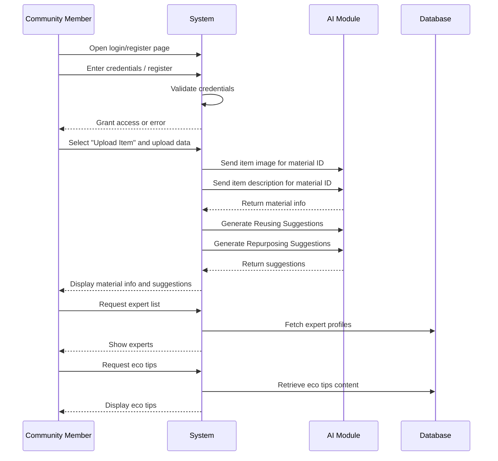
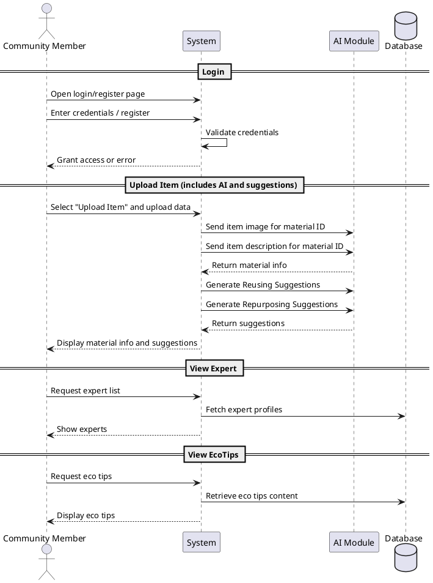
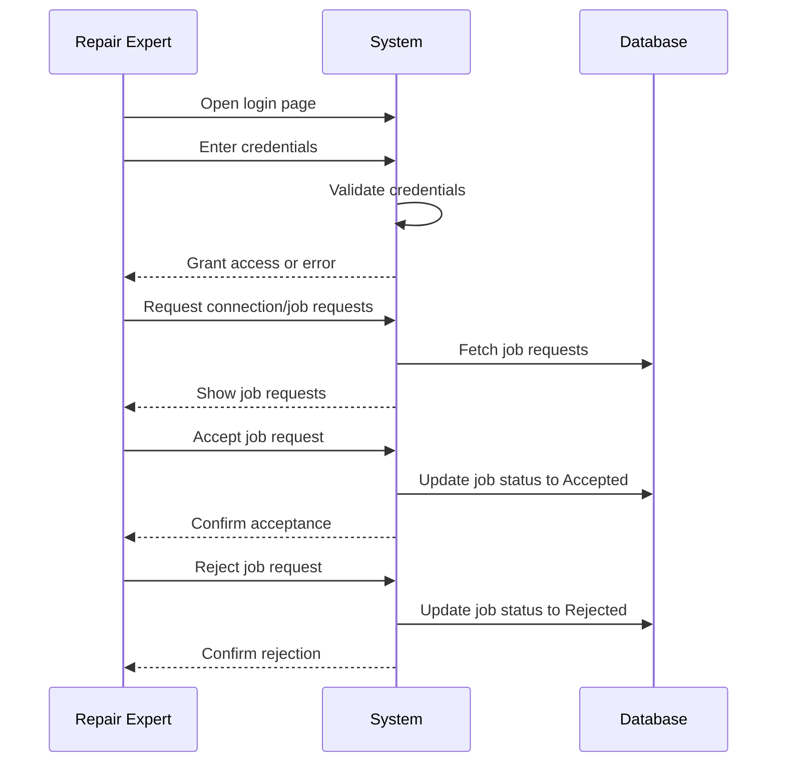
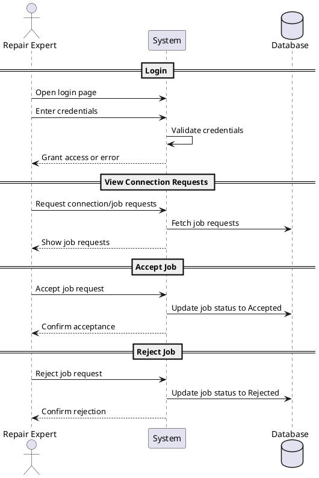
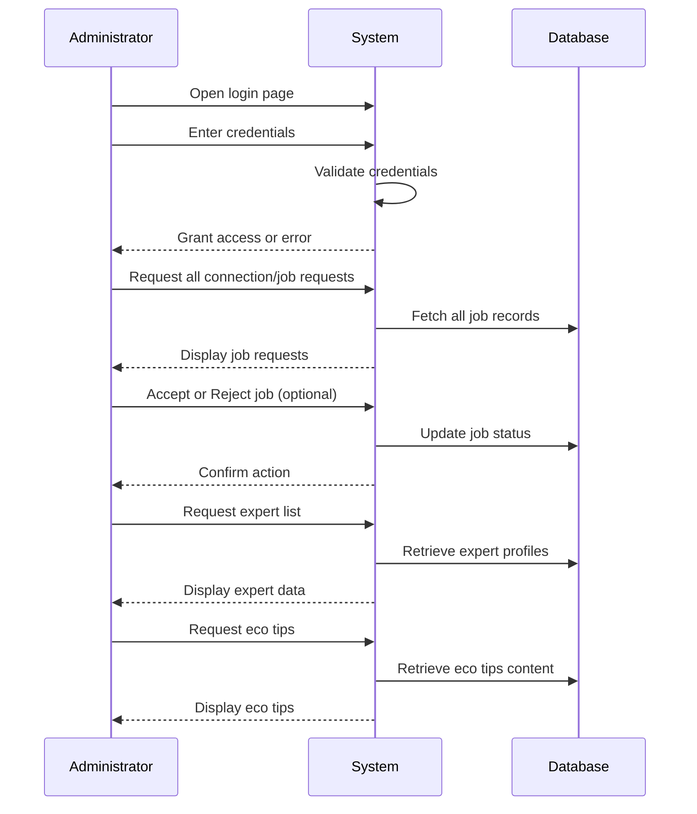
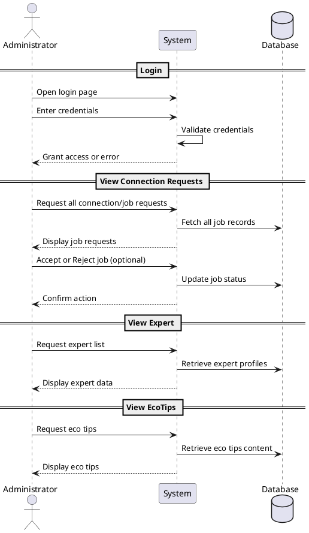

# Sequence Diagrams

## 1. Community Member

### Mermaid

```mermaid
sequenceDiagram
    participant CM as Community Member
    participant SYS as System
    participant AI as AI Module
    participant DB as Database

    %% Login
    CM->>SYS: Open login/register page
    CM->>SYS: Enter credentials / register
    SYS->>SYS: Validate credentials
    SYS-->>CM: Grant access or error

    %% Upload Item (includes AI and suggestions)
    CM->>SYS: Select "Upload Item" and upload data
    SYS->>AI: Send item image for material ID
    SYS->>AI: Send item description for material ID
    AI-->>SYS: Return material info
    SYS->>AI: Generate Reusing Suggestions
    SYS->>AI: Generate Repurposing Suggestions
    AI-->>SYS: Return suggestions
    SYS-->>CM: Display material info and suggestions

    %% View Expert
    CM->>SYS: Request expert list
    SYS->>DB: Fetch expert profiles
    SYS-->>CM: Show experts

    %% View EcoTips
    CM->>SYS: Request eco tips
    SYS->>DB: Retrieve eco tips content
    SYS-->>CM: Display eco tips
```

### PlantUML

```plantuml
@startuml
actor CM as "Community Member"
participant SYS as "System"
participant AI as "AI Module"
database DB as "Database"

== Login ==
CM -> SYS : Open login/register page
CM -> SYS : Enter credentials / register
SYS -> SYS : Validate credentials
SYS --> CM : Grant access or error

== Upload Item (includes AI and suggestions) ==
CM -> SYS : Select "Upload Item" and upload data
SYS -> AI : Send item image for material ID
SYS -> AI : Send item description for material ID
AI --> SYS : Return material info
SYS -> AI : Generate Reusing Suggestions
SYS -> AI : Generate Repurposing Suggestions
AI --> SYS : Return suggestions
SYS --> CM : Display material info and suggestions

== View Expert ==
CM -> SYS : Request expert list
SYS -> DB : Fetch expert profiles
SYS --> CM : Show experts

== View EcoTips ==
CM -> SYS : Request eco tips
SYS -> DB : Retrieve eco tips content
SYS --> CM : Display eco tips
@enduml
```

## 2. Repair Expert

### Mermaid

```mermaid
sequenceDiagram
    participant RE as Repair Expert
    participant SYS as System
    participant DB as Database

    %% Login
    RE->>SYS: Open login page
    RE->>SYS: Enter credentials
    SYS->>SYS: Validate credentials
    SYS-->>RE: Grant access or error

    %% View Connection Requests
    RE->>SYS: Request connection/job requests
    SYS->>DB: Fetch job requests
    SYS-->>RE: Show job requests

    %% Accept Job
    RE->>SYS: Accept job request
    SYS->>DB: Update job status to Accepted
    SYS-->>RE: Confirm acceptance

    %% Reject Job
    RE->>SYS: Reject job request
    SYS->>DB: Update job status to Rejected
    SYS-->>RE: Confirm rejection
```

### PlantUML

```plantuml
@startuml
actor "Repair Expert" as RE
participant "System" as SYS
database "Database" as DB

== Login ==
RE -> SYS: Open login page
RE -> SYS: Enter credentials
SYS -> SYS: Validate credentials
SYS --> RE: Grant access or error

== View Connection Requests ==
RE -> SYS: Request connection/job requests
SYS -> DB: Fetch job requests
SYS --> RE: Show job requests

== Accept Job ==
RE -> SYS: Accept job request
SYS -> DB: Update job status to Accepted
SYS --> RE: Confirm acceptance

== Reject Job ==
RE -> SYS: Reject job request
SYS -> DB: Update job status to Rejected
SYS --> RE: Confirm rejection
@enduml
```

## 3. Administrator

### Mermaid

```mermaid
sequenceDiagram
    participant ADM as Administrator
    participant SYS as System
    participant DB as Database

    %% Login
    ADM->>SYS: Open login page
    ADM->>SYS: Enter credentials
    SYS->>SYS: Validate credentials
    SYS-->>ADM: Grant access or error

    %% View Connection Requests
    ADM->>SYS: Request all connection/job requests
    SYS->>DB: Fetch all job records
    SYS-->>ADM: Display job requests
    ADM->>SYS: Accept or Reject job (optional)
    SYS->>DB: Update job status
    SYS-->>ADM: Confirm action

    %% View Expert
    ADM->>SYS: Request expert list
    SYS->>DB: Retrieve expert profiles
    SYS-->>ADM: Display expert data

    %% View EcoTips
    ADM->>SYS: Request eco tips
    SYS->>DB: Retrieve eco tips content
    SYS-->>ADM: Display eco tips
```

### PlantUML

```plantuml
@startuml
actor "Administrator" as ADM
participant "System" as SYS
database "Database" as DB

== Login ==
ADM -> SYS: Open login page
ADM -> SYS: Enter credentials
SYS -> SYS: Validate credentials
SYS --> ADM: Grant access or error

== View Connection Requests ==
ADM -> SYS: Request all connection/job requests
SYS -> DB: Fetch all job records
SYS --> ADM: Display job requests
ADM -> SYS: Accept or Reject job (optional)
SYS -> DB: Update job status
SYS --> ADM: Confirm action

== View Expert ==
ADM -> SYS: Request expert list
SYS -> DB: Retrieve expert profiles
SYS --> ADM: Display expert data

== View EcoTips ==
ADM -> SYS: Request eco tips
SYS -> DB: Retrieve eco tips content
SYS --> ADM: Display eco tips
@enduml
```
